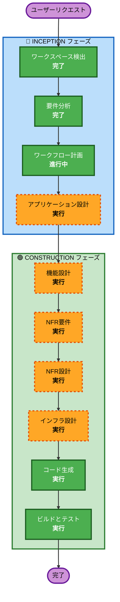

# 実行計画

## 詳細分析サマリー

### 変更影響評価
- **ユーザー向け変更**: あり — 経費精算の申請・承認・照会画面を新規構築
- **構造変更**: あり — フロントエンド・バックエンド・データベース・インフラを新規設計
- **データモデル変更**: あり — 経費精算・ユーザー・承認ルート等のスキーマを新規定義
- **API変更**: あり — REST APIを新規設計
- **NFR影響**: あり — セキュリティ（SECURITY-01〜15）、性能、可用性の要件あり

### リスク評価
- **リスクレベル**: 中（MVPスコープに限定しているため抑制）
- **ロールバック複雑度**: 低（新規構築のため既存影響なし）
- **テスト複雑度**: 中（外部連携バッチ、認証連携のテストが必要）

## ワークフロー可視化



### テキスト代替（ワークフロー可視化）
```
INCEPTION フェーズ:
  1. ワークスペース検出 (完了)
  2. 要件分析 (完了)
  3. ワークフロー計画 (進行中)
  4. アプリケーション設計 (実行予定)

CONSTRUCTION フェーズ:
  5. 機能設計 (実行予定)
  6. NFR要件 (実行予定)
  7. NFR設計 (実行予定)
  8. インフラ設計 (実行予定)
  9. コード生成 (実行予定)
  10. ビルドとテスト (実行予定)
```

## 実行するフェーズ

### 🔵 INCEPTION フェーズ
- [x] ワークスペース検出（完了）
- [x] 要件分析（完了）
- [x] ワークフロー計画（進行中）
- [ ] アプリケーション設計 — **実行**
  - **理由**: 新規システムのため、コンポーネント構成・サービス層・API設計の定義が必要

### 🟢 CONSTRUCTION フェーズ
- [ ] 機能設計 — **実行**
  - **理由**: 経費精算の業務ロジック（承認ワークフロー、代理申請/承認、ステータス遷移）の詳細設計が必要
- [ ] NFR要件 — **実行**
  - **理由**: セキュリティ拡張ルール全面適用、性能要件（同時100ユーザー/3秒以内）の具体化が必要
- [ ] NFR設計 — **実行**
  - **理由**: NFR要件に基づくセキュリティパターン・性能パターンの設計が必要
- [ ] インフラ設計 — **実行**
  - **理由**: AWSサーバーレス構成（Lambda + API Gateway + S3 + SES + PostgreSQL）のインフラ設計が必要
- [ ] コード生成 — **実行**（常時実行）
  - **理由**: アプリケーションコードの実装
- [ ] ビルドとテスト — **実行**（常時実行）
  - **理由**: ビルド手順・テスト手順の策定

### 🟡 OPERATIONS フェーズ
- [ ] 運用 — プレースホルダー（将来対応）

## スキップするフェーズ

### 🔵 INCEPTION フェーズ
- リバースエンジニアリング — **スキップ**
  - **理由**: グリーンフィールドプロジェクトのため不要
- ユーザーストーリー — **スキップ**
  - **理由**: ユーザーが承認時にスキップを選択。要件定義書で利用者区分と機能要件が十分に定義済み
- ユニット生成 — **スキップ**
  - **理由**: MVPスコープ（経費精算のみ）のため、単一ユニットとして扱う。複数ユニットへの分割は不要

## 成功基準
- **主目標**: 経費精算の申請・承認・照会が正常に動作するMVPの構築
- **主要成果物**:
  - React（TypeScript）フロントエンドアプリケーション
  - Python（FastAPI）バックエンドAPI
  - PostgreSQLデータベーススキーマ
  - AWSサーバーレスインフラ構成
  - セキュリティ拡張ルール準拠の実装
- **品質ゲート**:
  - 全機能要件（FR-001〜FR-012）の実装完了
  - 全非機能要件（NFR-001〜NFR-007）の充足
  - セキュリティ拡張ルール（SECURITY-01〜15）の準拠確認
  - ユニットテスト・統合テストの実行手順策定
